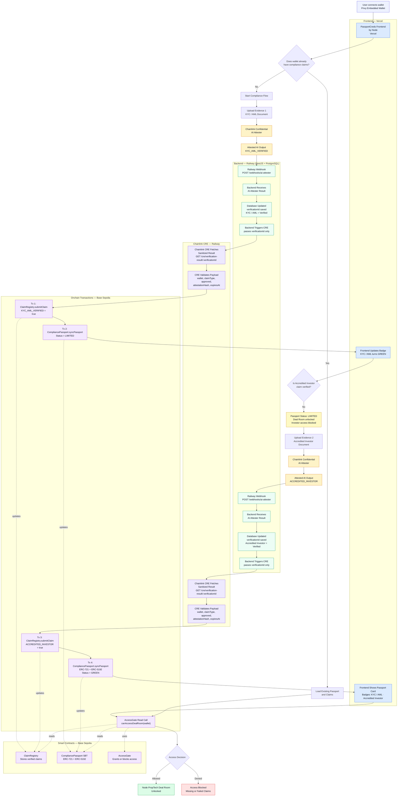

# PassportCreds by Node

**White-label Compliance Passport for regulated onchain access.**

Built for ETHGlobal · Chainlink · Base Sepolia


---

## Live Demo

**Frontend:** https://passport-creds-node-web.vercel.app/

**Infrastructure:**
- API + PostgreSQL: Railway
- CRE workflow: Railway
- Frontend: Vercel

**Contracts — Base Sepolia (all verified on Basescan):**

| Contract | Address |
|---|---|
| ClaimRegistry | [`0xE33f1BD4c360A035a9F62043A54BA9812f36d634`](https://sepolia.basescan.org/address/0xE33f1BD4c360A035a9F62043A54BA9812f36d634) |
| CompliancePassport | [`0x9EFd338b9E43577264665348Bd39548f5b044627`](https://sepolia.basescan.org/address/0x9EFd338b9E43577264665348Bd39548f5b044627) |
| AccessGate | [`0xD23c3e140d8FA5d81D1f9966A3093Dc38443cDF6`](https://sepolia.basescan.org/address/0xD23c3e140d8FA5d81D1f9966A3093Dc38443cDF6) |

---

## Origin

This project started from a real internal problem at **Node PropTech**.

We needed a way to verify that investors accessing a regulated deal room were KYC-cleared and accredited — without storing sensitive documents, without a fragile manual process, and without building a bespoke integration for every compliance provider we might work with.

As we thought about it more, we realised this is not a Node problem. Any platform dealing with regulated assets — real estate, private equity, tokenised securities — faces the exact same friction. The infrastructure for compliant onchain access simply does not exist in a reusable, privacy-preserving form.

That led us to PassportCreds: a white-label, protocol-agnostic Compliance Passport that any platform can embed. The concept aligns closely with the Creds protocol described in [this paper](https://arxiv.org/pdf/2606.03771), which explores verifiable credential systems for privacy-preserving identity. The Chainlink Confidential AI Attester turned out to be the perfect primitive — we discovered it almost by accident, and it fits the use case exactly: evaluate sensitive compliance documents inside a TEE without the document ever leaving the enclave.

During the build we used **Claude Code** (Claude Sonnet) and **ChatGPT** as coding assistants for scaffolding, debugging, and iteration. All product decisions and protocol architecture are human-authored.

---

## How It Works

1. User connects with **Privy Embedded Wallet**
2. Uploads a compliance document (KYC/AML or Accredited Investor evidence)
3. **Chainlink Confidential AI Attester** evaluates the document inside a TEE — no PII escapes the enclave
4. Verdict delivered via webhook to backend (Railway)
5. Backend triggers **Chainlink CRE** with `verificationId` only — no raw data, no PII
6. CRE fetches sanitized result, validates, and writes two onchain transactions to Base Sepolia
7. Soulbound Compliance Passport (ERC-721 + ERC-5192) minted or updated
8. **AccessGate** reads claims and passport — Deal Room unlocks

---

## Flow Diagram



---

## Chainlink Integration

### Chainlink Confidential AI Attester

Compliance documents are evaluated inside a **Trusted Execution Environment (TEE)** using Gemma4. The document never leaves the enclave. The model returns a structured JSON verdict — `approved`, `confidence`, `reasonCode`, `summary` — delivered asynchronously to our backend via webhook.

Key design decisions:
- `verificationId` embedded in the callback URL — resolves the exact session even with concurrent verifications
- AI output never goes onchain — only a `keccak256` attestation hash is written as the onchain fingerprint
- Replay protection — `verificationIdHash` permanently stored in ClaimRegistry; duplicate submissions revert

### Chainlink CRE

CRE is the **sole authorized writer** to our smart contracts. It holds `CRE_UPDATER_ROLE` — the only key allowed to call `ClaimRegistry.submitClaim` and `CompliancePassport.syncPassport`.

CRE workflow per verification:
1. Receive `verificationId` from backend
2. `GET /cre/verification-result/:verificationId` — fetch sanitized result
3. Validate payload
4. `keccak256(verificationId)` → `verificationIdHash`
5. `ClaimRegistry.submitClaim(...)` — write claim onchain
6. `CompliancePassport.syncPassport(...)` — mint or update soulbound passport
7. `AccessGate.getAccessSummary(...)` — read access decision
8. `POST /cre/workflow-result` — return tx hashes to backend

---

## Smart Contracts

| Contract | Type | Role |
|---|---|---|
| `ClaimRegistry.sol` | AccessControl | Stores verified claims per wallet. Only CRE can write. |
| `CompliancePassport.sol` | ERC-721 + ERC-5192 | Soulbound passport. Minted on first claim. Status derived from ClaimRegistry. |
| `AccessGate.sol` | Read-only | Reads ClaimRegistry + CompliancePassport. Answers `canAccessDealRoom`, `canAccessInvestorArea`. |

Claims: `KYC_AML_VERIFIED` · `ACCREDITED_INVESTOR`

Passport status: `NONE → IN_PROGRESS → LIMITED → GREEN` (or `RED` on KYC failure, `REVOKED` by admin)

---

## Repo Structure

```
apps/
  api/       — NestJS backend (Prisma + PostgreSQL)
  web/       — Next.js 14 frontend (TailwindCSS + Privy)
contracts/   — Foundry smart contracts (Solidity)
cre/         — Chainlink CRE workflow (TypeScript + viem)
demo/        — Synthetic compliance documents + AI prompts
docs/        — Architecture, AI usage, judges notes
```

---

## Privacy Rules

- No PII stored onchain — only `keccak256` hashes
- No raw documents stored anywhere — forwarded to Chainlink TEE only, then discarded
- Backend exposes sanitized verdict to CRE only — no raw AI output, no documents
- `verificationIdHash` replay protection on every claim submission

---

## How to Test the Demo

**No local setup needed — everything runs on Railway and Vercel.**

1. Open https://passport-creds-node-web.vercel.app/
2. Connect with Privy Embedded Wallet (email or social login — no browser extension needed)
3. On the Passport page, click **Download Sample Document** before uploading — the app requires it
4. Upload the downloaded file and click **Submit for Verification**
5. The Chainlink Confidential AI Attester evaluates the document and delivers the result via webhook
6. If the live Attester is unavailable, click **⚡ Demo: Simulate Verified** to run the full pipeline with a saved sample result
7. Repeat for the Accredited Investor claim to reach passport status **GREEN** and unlock the Deal Room

### About the prompts and sample documents

The AI Attester is instructed via structured system prompts located in `demo/`:

| File | Purpose |
|---|---|
| `demo/prompt-kyc-aml.txt` | Instructs Gemma4 to evaluate KYC/AML evidence and return structured JSON |
| `demo/prompt-accredited-investor.txt` | Instructs Gemma4 to evaluate Accredited Investor evidence and return structured JSON |

The prompts ask the model to return a minified JSON verdict only — `claimType`, `approved`, `confidence`, `reasonCode`, `summary`. No prose, no explanation. This keeps the output deterministic and parseable by the backend.

The sample documents available for download in the app (`public/samples/`) are intentionally simple synthetic files. The goal is not to test document quality — it is to demonstrate the full pipeline: document → TEE evaluation → webhook → CRE → onchain claim → passport → access decision.

---

## Quick Start (local)

```bash
# Start everything
make up

# Run E2E demo
make test-green
```

---

## Documentation

| Doc | Description |
|---|---|
| [Architecture](docs/architecture.md) | Actors, stack, data flow, design decisions |
| [AI Usage](docs/ai-usage.md) | How AI is used in the product and in development |
| [Judges](docs/judges.md) | Prize tracks, proof of work, full flow diagram |
