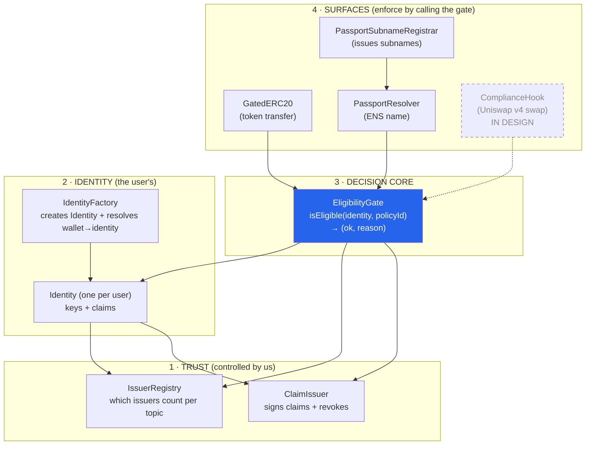
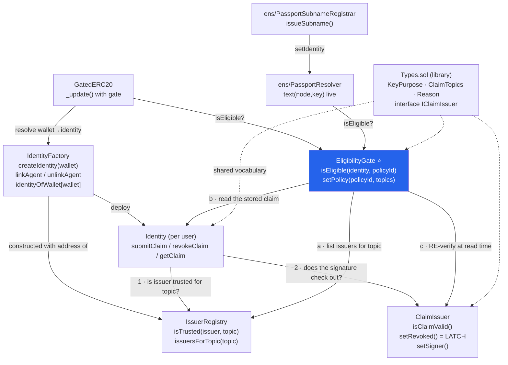

# PassportKit — Contracts reference

Detail of **each on-chain contract** (`contracts/src/`): what it does, its functions, and how it relates
to the others. **The end-to-end flow (tenant setup → user → agent → money moment) lives in
[`HANDOFF.md`](./HANDOFF.md) §3** — this file is only the contract detail.

> ETHGlobal Lisbon 2026 (Continuity track). **Thesis:** _identity before access, compliance before liquidity._
> The demo hero is the **REFUSAL (revocation)**, not the green check. Chain: **Ethereum Sepolia**.
> 9 contracts, 63 tests passing.

---

## Invariants that tie it all together (must not drift)

- **Model B — no privileged writer:** the issuer only *signs* (EIP-712); the user submits their own claim. Trust = the signature, re-verified **at read time** by the gate. Nobody writes to another user's identity.
- **Revocation = latch** on `ClaimIssuer` (`setRevoked`). While latched, `isClaimValid` is false → every surface refuses **and** no fresh claim can land. Only the issuer re-opens.
- **One single gate** for all surfaces → revoking one claim refuses on all of them at once (*money moment*).
- **Agent (Model A):** `identityOfWallet[agentWallet] = personIdentity`. The agent inherits the person's eligibility. **Revoke the person → their agents are blocked too.**
- **Free-exit:** compliance blocks movement to a counterparty (transfer/swap), never your own exit (burn / removeLiquidity).
- **Zero PII on-chain:** claim `data = abi.encode(dataHash, expiresAt, nonce)` — a hash/reference only, never PII.

**Claim topics:** `KYC_VERIFIED` · `PROOF_OF_PERSONHOOD` · `ACCREDITED_INVESTOR`.
**Policies (from deploy):** `#1 Deal Room = [KYC_VERIFIED]` · `#2 Investor = [KYC_VERIFIED, ACCREDITED_INVESTOR]`.
**Reasons:** `OK`, `NO_IDENTITY`, `NO_POLICY`, `MISSING_KYC`, `MISSING_PERSONHOOD`, `MISSING_ACCREDITED`, `MISSING_CLAIM`.

---

## Quick glossary

| Term | What it is |
|---|---|
| **Identity** | The user's ONCHAINID contract. Holds "keys" (ERC-734) and "claims" (ERC-735). |
| **Claim** | A credential ("passed KYC"). On-chain it's only a **hash**, never personal data. |
| **Topic** | The *type* of claim, as `uint256(keccak256(name))`. |
| **Issuer** | Who issues/signs a claim (KYC, WorldID). Signs off-chain via EIP-712. |
| **Policy** | The set of topics a surface requires. |
| **Gate** | The `EligibilityGate` — the central function that decides yes/no. |
| **Surface** | Where enforcement happens: token, ENS, swap hook, app. |
| **Tenant** | A customer of the kit (a brand), owner of a parent ENS name (e.g. `brandx.eth`). |
| **Model B** | Only the owner writes to their own identity; trust = the signature. |
| **Model A** | An agent points to a person's identity and inherits their compliance. |

---

## Big picture: 4 layers

Contract structure by layer — the lower ones provide support, the top one does the enforcement.
**Everything funnels into the `EligibilityGate`**: change the rule there, and it changes on every surface.

---

## Relationship between contracts (named calls)

The same map, but with **each real call** labeled — you can trace every arrow with your finger.

---

## Contract by contract

### `libraries/Types.sol` — the shared vocabulary
**Not a deployable contract.** It's the "common language" used by contracts, backend, and frontend, so
everyone speaks about exactly the same values.
- **`KeyPurpose`** — ERC-734 key purposes: `MANAGEMENT=1`, `ACTION=2`, `CLAIM=3`. A `MANAGEMENT` key satisfies **any** purpose.
- **`ClaimTopics`** — claim types as a stable number: `uint256(keccak256("KYC_VERIFIED"))`, etc. Hashing the name avoids collisions and is traceable.
- **`Reason`** — `bytes32` codes the gate returns to explain a refusal (`MISSING_KYC`, `NO_IDENTITY`, `NO_POLICY`…). Cheap, and surfaced directly in the UI/reverts.
- **`IClaimIssuer`** — the minimal interface (`isClaimValid`) that Identity and EligibilityGate need from the issuer.

**Why it exists:** centralizing these values keeps the whole system consistent — a topic is the same number everywhere.

---

### `IssuerRegistry.sol` — which issuer is trusted, for which topic
A **small set we control** (`DEFAULT_ADMIN_ROLE`). Stores `issuer → topic → trusted` and keeps the
**enumerable list** `issuersForTopic(topic)`.

| Function | Role |
|---|---|
| `setTrusted(issuer, topic, ok)` | add/remove a trusted issuer (swap-and-pop keeps the list clean) |
| `isTrusted(issuer, topic)` | used by **Identity** at write time |
| `issuersForTopic(topic)` | used by the **gate** at read time |

**Why it exists (security):** the gate iterates over `issuersForTopic` — a list **only we** control. If it
iterated over "every claim that landed on an identity", an attacker could inflate that list and make
verification expensive/stuck (griefing). Here that's impossible.

---

### `ClaimIssuer.sol` — signs claims and is the AUTHORITY on validity
Signs claims via **EIP-712** (off-chain) and holds the revocation levers, **re-checked at write and at read time**.

| Function | Role |
|---|---|
| `isClaimValid(identity, topic, sig, data)` | the heart: validates encoding, checks expiry, recovers the signer and confirms it's authorized. Returns `false` (no revert) if anything is wrong/revoked — a malformed claim never bricks verification |
| `setRevoked(identity, topic, bool)` | **per-user latch**: on = the gate refuses and no new claim can land. Only the issuer turns it off |
| `setSigner(signer, bool)` | **global lever**: turning off a signer invalidates **everything** it signed (leaked key) |

**Why it exists:** it separates "the user owns their identity" from "the user controls claim validity". The
owner holds the claim, but does **not** decide whether it counts — the issuer does, re-asked on every read.
This is stronger than classic by-signature revocation (which a fresh signature would bypass).

---

### `Identity.sol` — the user's on-chain identity (ERC-734 + ERC-735)
**One contract per user.** The user's wallet enters as the **MANAGEMENT key**.

| Function | Role |
|---|---|
| `submitClaim(topic, issuer, sig, data)` | **only the owner** writes; validates trusted issuer (IssuerRegistry) + signature (ClaimIssuer). Stores only a hash, never PII |
| `revokeClaim(topic, issuer)` | **voluntary** removal by the owner. **Not** the compliance lever — that's the issuer's |
| `getClaim(topic, issuer)` | read used by the gate |

**Built-in anti-griefing defenses:** `claimId = keccak(issuer, topic)` (one slot per pair, re-issuing updates
in place) · `MAX_CLAIMS_PER_TOPIC = 16` (per-topic cap) · only trusted issuers land.

**Model B in practice:** since only the owner (a CLAIM/MANAGEMENT key on their own identity) can write,
**nobody can write to someone else's identity** — the griefing vector dies at the key gate.

---

### `IdentityFactory.sol` — creates identities and resolves wallet → identity
| Function | Role |
|---|---|
| `createIdentity(wallet)` | **deploys a new `Identity`** (backend, `AGENT_ROLE`). The wallet becomes its MANAGEMENT key |
| `identityOfWallet[wallet]` | the map that **token, hook and ENS** use to find a wallet's identity |
| `linkAgent(agentWallet, personIdentity)` | **Model A**: points an agent wallet at an existing person's identity, without minting a new one. The agent has **no claims of its own** — it resolves `agentWallet → personIdentity → isEligible` |
| `unlinkAgent(agentWallet)` | disowns **one** agent surgically, without touching the person or their other agents |

**Consequence:** revoke the **person** → **all their agents** are blocked at once ("eligibility infrastructure
for humans AND agents").

---

### `EligibilityGate.sol` ⭐ — the ONE read every surface uses
`isEligible(identity, policyId) → (bool ok, bytes32 reason)`. A **policy** is a set of required topics,
configured via `setPolicy(policyId, topics)`.

How it decides, for each required topic:
1. get the trusted issuers for the topic (IssuerRegistry);
2. read the matching claim off the Identity (`getClaim`);
3. **re-verify with the ClaimIssuer** (`isClaimValid`) — revocation + signer + expiry.

Robustness: **fail-closed** (unset policy → deny, `NO_POLICY`) · **`try/catch`** per issuer (a malformed claim
is ignored, not allowed to brick everything) · iterates only over the controlled list (`issuersForTopic`) → can't be griefed.

**Why it's the center:** it's the single place where the "allowed or not" rule lives. And because it re-asks the
issuer, **the identity owner can't override** a platform decision.

---

### `GatedERC20.sol` — the "transfer gate" surface (permissioned ERC-20)
An ERC-20 whose `_update` (the internal hook of every movement) consults the gate.

| Operation | Who is checked |
|---|---|
| **mint** (`from == 0`) | the recipient `to` must be eligible |
| **transfer** | **both** `from` and `to` must be eligible |
| **burn** (`to == 0`) | **nobody** — exit is always free |

It resolves `wallet → identity` via IdentityFactory and calls `isEligible(identity, policyId)`.

***Free-exit*:** compliance blocks **movement to a counterparty** (transfer), but **never your own exit**
(burn/redeem). Revoked → your transfer fails, but you can always burn and exit.

---

### `ens/PassportResolver.sol` — ENS surface (read-through, computed live)
A custom ENS resolver whose `text(node, key)` is **computed on the fly** from the EligibilityGate — no
`setText`, no sync keeper. Revoked → the name **flips itself**: `compliance.status` is `NONE` (no identity/tenant),
`GREEN` (eligible), or `REVOKED` (not eligible); `compliance.identity` returns the identity address.

| Function | Role |
|---|---|
| `setTenant(parentNode, gate, policyId, controller)` | each tenant registers its config (TOFU: first caller wins) |
| `setIdentity(node, parentNode, identity)` | binds a subname to an identity (only the tenant's controller) |
| `text(node, key)` | ENS `ITextResolver`, computed live: `compliance.status` (from the gate) **and `agent-registration[<registry>][<agent>]` (ENSIP-25, from the IdentityFactory link)** |
| `registry7930()` / `agentRegistrationKey(agent)` | ERC-7930 registry address + the exact ENSIP-25 key, so clients build the same key the resolver matches |

**ENSIP-25 (Verifiable Agent Identity):** the resolver serves the `agent-registration[...]` record **live** — it returns `"1"` iff the agent wallet is linked to this name's identity in the `IdentityFactory` (constructor-injected). `linkAgent` makes the attestation appear, `unlinkAgent` removes it — no manual `setText`. Spec: [`specs/ensip-25-agent-identity.md`](./specs/ensip-25-agent-identity.md).

**Agent reputation (`agent.reputation[<agent>]`):** also computed live — returns the agent's decimal score from the `ScoreRegistry` (optional, constructor-injected; zero = feature off), gated to agents linked to this name. DEMO: scores are set by hand in the `ScoreRegistry`; production feeds it from the subgraph risk-signal / an ERC-8004 reputation registry. `registry7930()`, `agentRegistrationKey(agent)`, `agentReputationKey(agent)` are exposed so clients build the exact keys.

---

### `ScoreRegistry.sol` — per-agent reputation store (demo stand-in for ERC-8004 reputation)
`scoreOf[agent]` + `setScore(agent, score)` (`SCORER_ROLE`). A minimal on-chain source the resolver reads to serve `agent.reputation[<agent>]` via ENS. DEMO values are set manually; production would feed it from off-chain behavior (the subgraph) or an ERC-8004 reputation registry.

**White-label:** a single resolver serves **N tenants** — each `parentNode` carries its own `(gate, policyId, controller)`.
Since ENS calls `text(...)` via `eth_call`, the extra SLOADs **cost the user nothing**.

---

### `ens/PassportSubnameRegistrar.sol` — ENS surface (issue subnames by code)
The "kit/SDK" piece: given a name the tenant already owns, it issues `user.tenant.eth` subnames via
**NameWrapper**, pointing at the `PassportResolver`, and binds `node → identity`.

| Function | Role |
|---|---|
| `issueSubname(parentNode, label, userWallet, identity)` | creates the subname (NameWrapper) and binds it to the identity (`resolver.setIdentity`) in one step |

**Why it exists:** it's what makes PassportKit a **real SDK** — the tenant onboards users and the kit mints
their identity name programmatically, with zero manual UI. It's also the mechanism for the **agent's** subname.

---

### `ComplianceHook` (Uniswap v4) — 4th surface, **IN DESIGN**
Does **not exist** yet in `contracts/src/` (marked *IN DESIGN* in CLAUDE.md). Plan: a v4 hook that gates
**swaps** through the **same** EligibilityGate, with free `removeLiquidity` (free-exit) — mirroring GatedERC20
in the AMM world. Dashed in the diagrams because it isn't implemented.

---

## Roles summary

| Contract | Role in one line | Who controls it | Layer |
|---|---|---|---|
| `Types.sol` | Shared vocabulary (not deployable) | — | base |
| `IssuerRegistry` | Which issuers count per topic | Admin (us) | 1 trust |
| `ClaimIssuer` | Signs claims + authority on validity/revocation | Issuer/Admin | 1 trust |
| `Identity` | The user's identity (keys + claims) | Owner (Model B) | 2 identity |
| `IdentityFactory` | Creates Identity + resolves wallet→identity + agents | Backend (AGENT_ROLE) | 2 identity |
| `EligibilityGate` ⭐ | The single eligibility decision | Admin sets policies | 3 decision |
| `ScoreRegistry` | Per-agent reputation store (read by the ENS `agent.reputation` record) | Scorer (SCORER_ROLE) | 2 identity |
| `GatedERC20` | Enforcement on transfers | — (reads the gate) | 4 surface |
| `PassportResolver` | Enforcement on ENS (read-through) | Tenant's controller | 4 surface |
| `PassportSubnameRegistrar` | Issuing subnames by code | Tenant (ISSUER_ROLE) | 4 surface |
| `ComplianceHook` | Enforcement on swaps (IN DESIGN) | — | 4 surface |

> To see these contracts **in motion** (ops wires the tenant → user creates identity + WorldID → links
> an agent → money moment), see [`HANDOFF.md`](./HANDOFF.md) §3.
