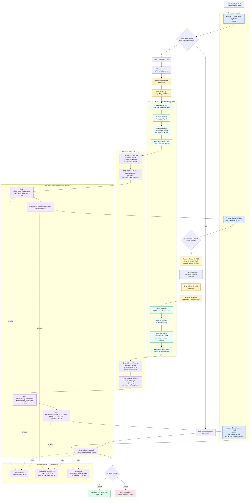

# Judges — PassportCreds by Node

## How to Test

**No local setup needed.**

1. Open https://passport-creds-node-web.vercel.app/
2. Connect with Privy Embedded Wallet (email or social — no browser extension needed)
3. On the Passport page, click **Download Sample Document** — the upload is gated until you download
4. Upload the file and click **Submit for Verification**
5. The Chainlink Confidential AI Attester evaluates the document and delivers the verdict via Railway webhook
6. If the live Attester is unavailable, use **⚡ Demo: Simulate Verified** — runs the full backend → CRE → onchain pipeline with a saved sample result
7. Repeat for Accredited Investor to reach passport **GREEN** and unlock the Deal Room

### Prompts and sample documents

The Attester is driven by structured system prompts in `demo/`:
- `demo/prompt-kyc-aml.txt` — instructs Gemma4 to evaluate KYC/AML evidence, return minified JSON verdict
- `demo/prompt-accredited-investor.txt` — same for Accredited Investor evidence

Sample documents (`apps/web/public/samples/`) are synthetic. The point is the pipeline, not document realism.

---

## Live Demo

**Frontend:** https://passport-creds-node-web.vercel.app/

**Infrastructure:**
- API (NestJS + PostgreSQL): Railway
- CRE (Chainlink workflow): Railway
- Frontend: Vercel

**Contracts — Base Sepolia (all verified):**

| Contract | Address | Basescan |
|---|---|---|
| ClaimRegistry | `0xE33f1BD4c360A035a9F62043A54BA9812f36d634` | [View](https://sepolia.basescan.org/address/0xE33f1BD4c360A035a9F62043A54BA9812f36d634) |
| CompliancePassport | `0x9EFd338b9E43577264665348Bd39548f5b044627` | [View](https://sepolia.basescan.org/address/0x9EFd338b9E43577264665348Bd39548f5b044627) |
| AccessGate | `0xD23c3e140d8FA5d81D1f9966A3093Dc38443cDF6` | [View](https://sepolia.basescan.org/address/0xD23c3e140d8FA5d81D1f9966A3093Dc38443cDF6) |

**Sample onchain transactions:**
- Claim submission: `0x8714479e...` (ClaimRegistry.submitClaim via CRE)
- Passport revocation: `0x1a294ebf1fe4e135867b8be1034fc06ca335382464ec2bd701fd9b0646eb2377`

---

## Track 1 — Best Workflow with CRE ($6,000)

### What we built

We built a **Chainlink CRE workflow** that acts as the sole authorized orchestrator between our backend and the Base Sepolia smart contracts. No other actor — not the frontend, not the backend, not the user — can write compliance state onchain. Only the CRE workflow holds `CRE_UPDATER_ROLE`.

### How it meets the requirements

**Integrate at least one blockchain with an external API, system, data source, LLM, or AI agent:**

The CRE workflow connects two external systems to Base Sepolia:
1. Our NestJS backend (`GET /cre/verification-result/:verificationId`) — fetches the sanitized AI verdict
2. The Chainlink Confidential AI Attester — the AI agent that evaluated the compliance document upstream

**Demonstrate a successful simulation or live deployment:**

The CRE workflow runs live on Railway and has executed real onchain transactions on Base Sepolia. The workflow is also runnable locally via `npx ts-node cre/src/server.ts`.

**Be meaningfully used in the project:**

CRE is not a demo stub. It is the critical path of the entire product:

```
Backend triggers CRE with verificationId
  → CRE fetches sanitized result from backend
  → CRE validates payload
  → CRE calls ClaimRegistry.submitClaim (Tx)
  → CRE calls CompliancePassport.syncPassport (Tx)
  → CRE reads AccessGate.getAccessSummary
  → CRE posts result back to backend
```

### CRE workflow — step by step

| Step | Action |
|---|---|
| 1 | Receive `verificationId` from backend |
| 2 | `GET /cre/verification-result/:verificationId` — fetch sanitized result |
| 3 | Validate: `wallet`, `claimType`, `approved`, `attestationHash`, `expiresAt` |
| 4 | `keccak256(verificationId)` → `verificationIdHash` (replay protection) |
| 5 | `ClaimRegistry.submitClaim(...)` — write claim onchain |
| 6 | `CompliancePassport.syncPassport(...)` — mint or update soulbound passport |
| 7 | `AccessGate.getAccessSummary(wallet)` — read access decision |
| 8 | `POST /cre/workflow-result` — return tx hashes to backend |

### Code location

```
cre/src/main.ts       — workflow entrypoint
cre/src/server.ts     — HTTP server (POST /trigger, GET /health)
```

---

## Track 2 — Best Usage of Chainlink Confidential AI Attester ($4,000)

### What we built

We use the Chainlink Confidential AI Attester as the **compliance evaluation engine** for a regulated onchain access product. Users upload KYC/AML and Accredited Investor evidence. The Attester evaluates documents inside a TEE (Gemma4) and returns a structured JSON verdict. The document never leaves the enclave. No PII ever touches a smart contract.

### How it meets the requirements

**Use the provided Chainlink Confidential AI inference APIs:**

We call `POST https://confidential-ai-dev-preview.cldev.cloud/v1/inference` with:
- A structured system prompt (in `demo/prompt-kyc-aml.txt` and `demo/prompt-accredited-investor.txt`)
- The compliance document as a base64 resource
- A `cre_callback` pointing to our Railway webhook

**Submit at least one confidential inference request using the sandbox environment:**

Every verification in the live demo is a real Confidential AI Attester call. The system prompt instructs the model to return a minified JSON verdict — `claimType`, `approved`, `confidence`, `reasonCode`, `summary`.

**Process sensitive inputs such as financial documents, identity information, compliance records:**

The two claim types processed:
- `KYC_AML_VERIFIED` — identity and AML screening document
- `ACCREDITED_INVESTOR` — financial qualification evidence

Both represent exactly the sensitive compliance inputs the prize describes.

### The privacy architecture

```
Document (user upload)
  → Backend (held in memory only, never persisted)
  → Chainlink Confidential AI Attester (TEE — Gemma4)
  → Structured JSON verdict returned
  → Backend stores: claimType, approved, confidence, reasonCode, summary
  → keccak256(verdict) → attestationHash (the only thing written onchain)
  → Raw document discarded
```

No document is stored anywhere. No PII is written onchain. The `attestationHash` is the onchain fingerprint of the AI verdict — not the verdict itself.

### Webhook callback design

The Attester delivers its result asynchronously via `cre_callback`. We embed `?verificationId=<id>` in the callback URL so the webhook resolves the correct session even if multiple verifications for the same wallet are in flight simultaneously.

Webhook envelope received from Chainlink:
```json
{
  "input": {
    "inferenceId": "f8c3de3d-...",
    "output": "{\"claimType\":\"KYC_AML_VERIFIED\",\"approved\":true,\"confidence\":0.97,...}",
    "cre_callback": { "url": "...", "executed": false }
  }
}
```

### Code location

```
apps/api/src/webhooks/         — AI Attester webhook handler
apps/api/src/verification/     — verification session + AI Attester call
demo/prompt-kyc-aml.txt        — KYC/AML system prompt
demo/prompt-accredited-investor.txt — Accredited Investor system prompt
```

---

## Full Flow Diagram


