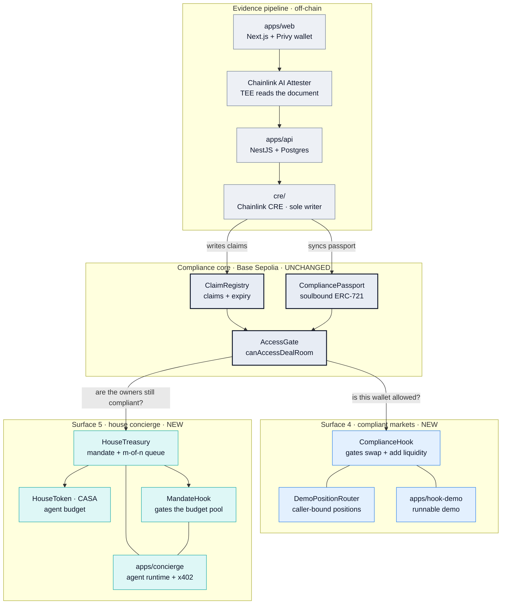
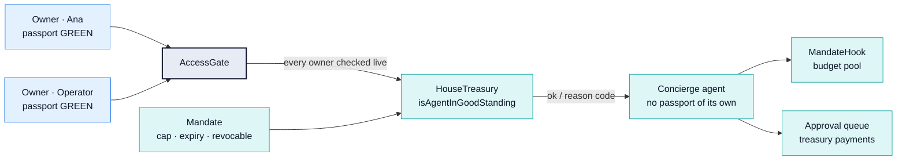
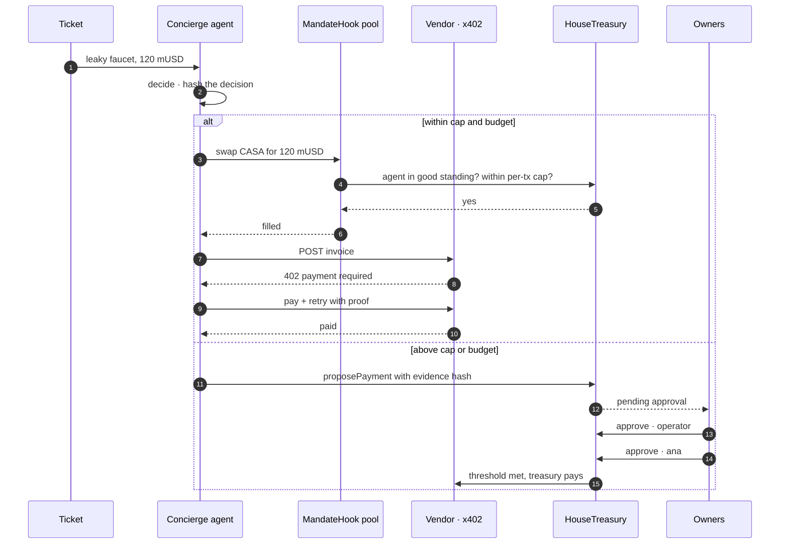
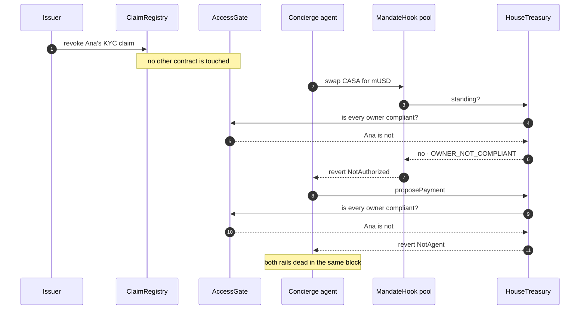
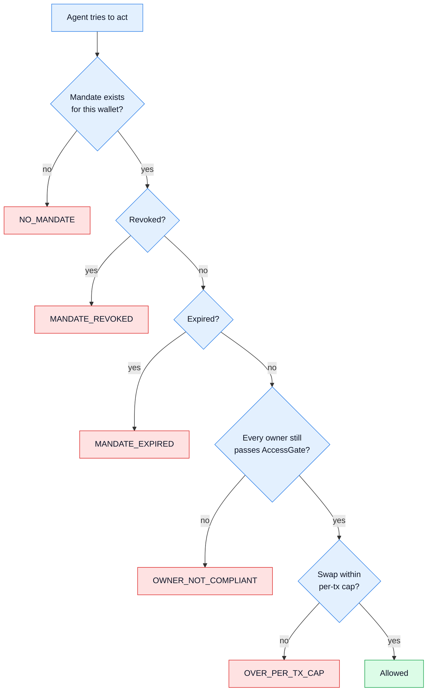
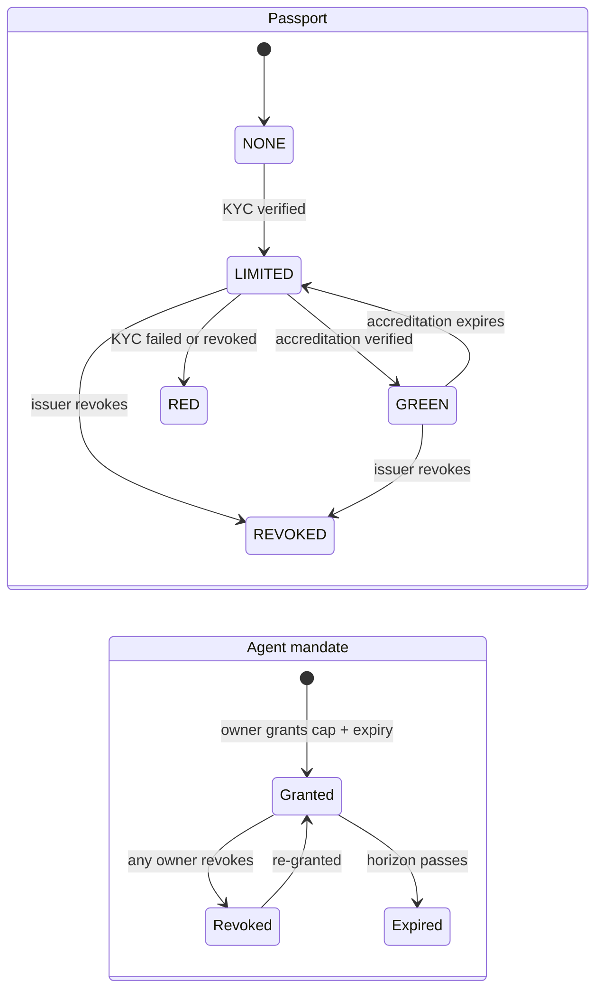

# PassportCreds — presentation diagrams

Copy-paste blocks for slides, HackMD, or the submission page. Grey = shipped at the
previous ETHGlobal, blue/teal = built for Lisbon 2026.

---

## 1. Continuity map — what existed, what we added

> One line for the pitch: *the compliance core is untouched; everything new is a
> surface that asks it the same question.*

---

## 2. The thesis — an agent's authority is borrowed from humans

> Agents can't KYC. So the concierge holds no passport: it holds a *mandate*, and the
> mandate is only alive while every owner's passport is.

---

## 3. Two spending rails

> Small things happen by themselves. Big things wait for humans. The boundary is
> enforced on-chain, not in the agent's code.

---

## 4. The kill switch — one revoke, both rails

> The demo moment. Nothing about the agent changes: its wallet, mandate and budget are
> untouched. A *human's* passport lapses and the agent loses its hands.

---

## 5. Why a wallet is refused — the reason codes

> Every refusal names itself, so the UI and the judges can see *which* rule bit.

---

## 6. Passport and mandate lifecycles

> Both are live state, not a snapshot: claims expire on their own, and the passport
> that gates the pool is the same one that gates the Deal Room.

---

## 7. Demo run sheet — two minutes

```mermaid
flowchart LR
    A["1 · Leaky faucet<br/>120 mUSD"] --> B["agent pays alone<br/>swap + x402"]
    B --> C["2 · Roof repair<br/>4500 mUSD"]
    C --> D["queued · 2 owners approve<br/>treasury pays"]
    D --> E["3 · Revoke Ana's KYC"]
    E --> F["both rails refuse<br/>OWNER_NOT_COMPLIANT"]
    F --> G["4 · Restore<br/>everything works again"]

    classDef step fill:#E3F0FE,stroke:#2C7FE8,color:#0D1428
    classDef out fill:#DEF7F6,stroke:#17A8A6,color:#0D1428
    classDef bad fill:#FEE2E2,stroke:#DC2626,color:#0D1428

    class A,C,E,G step
    class B,D out
    class F bad
```

