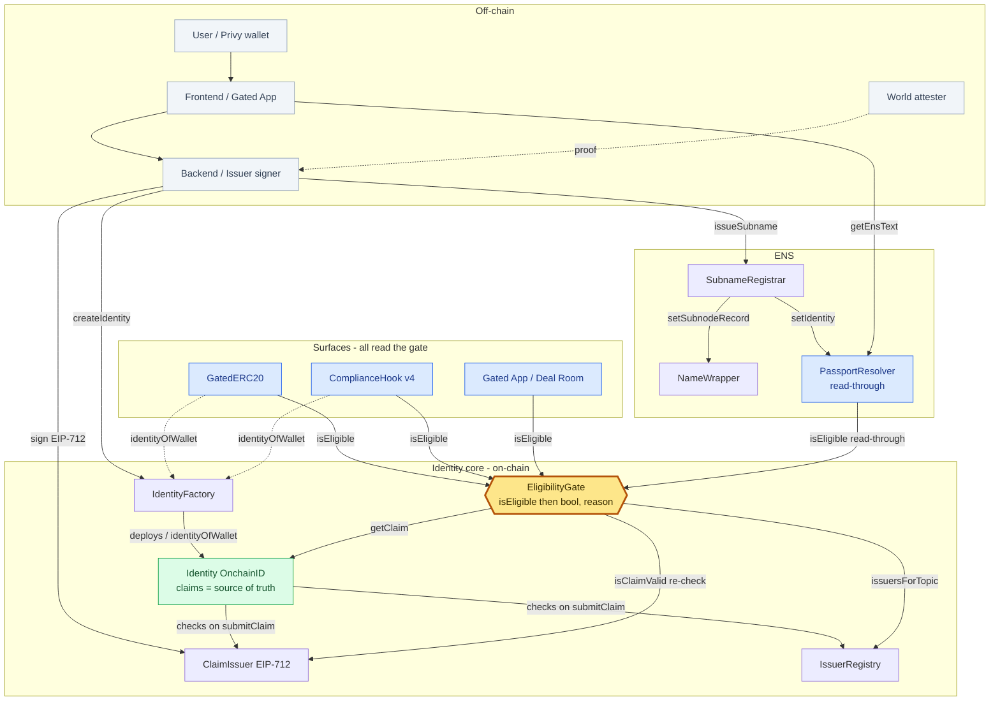

# Components — static relationships (who calls whom)

> Paste into HackMD. Complements the sequence diagrams. **The `EligibilityGate` is the hub** — every surface reads it; it reads `IssuerRegistry` + `Identity` and re-verifies with the `ClaimIssuer`.

## Legend
- **Solid arrow + label** = a call / relationship (who calls what).
- **Dashed** = a lookup (`identityOfWallet`) or off-chain proof.
- 🟡 **EligibilityGate** = the hub (single read point).
- 🟢 **Identity** = source of truth (claims container). **Revocation authority = ClaimIssuer** (per-user), re-checked at read.
- 🔵 **Surfaces** = GatedERC20, ComplianceHook, Gated App, PassportResolver — all read the gate.

## Read it in 4 sentences
1. **Backend** creates the identity, signs claims, and issues the ENS subname (by code).
2. **Identity** stores issuer-signed claims (Model B); on write it checks `IssuerRegistry` + `ClaimIssuer`.
3. **EligibilityGate** answers `isEligible` by looping trusted issuers, reading the claim off `Identity`, and **re-verifying with the `ClaimIssuer`** (revocation + signer).
4. **Every surface** (token, hook, gated app, ENS resolver) reads that one `isEligible` → one revoke flips all.
