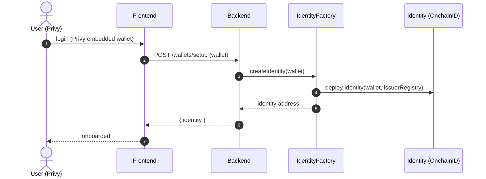
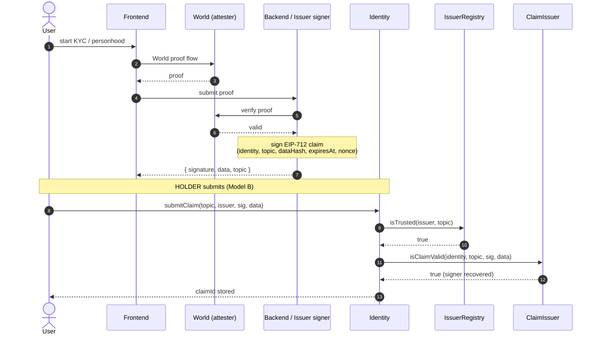
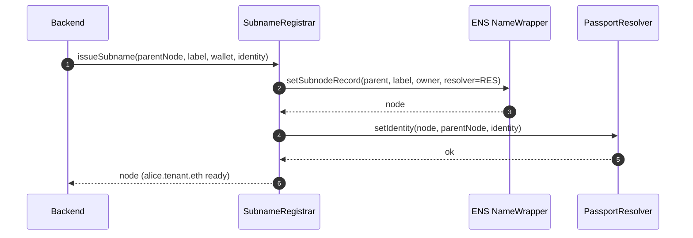
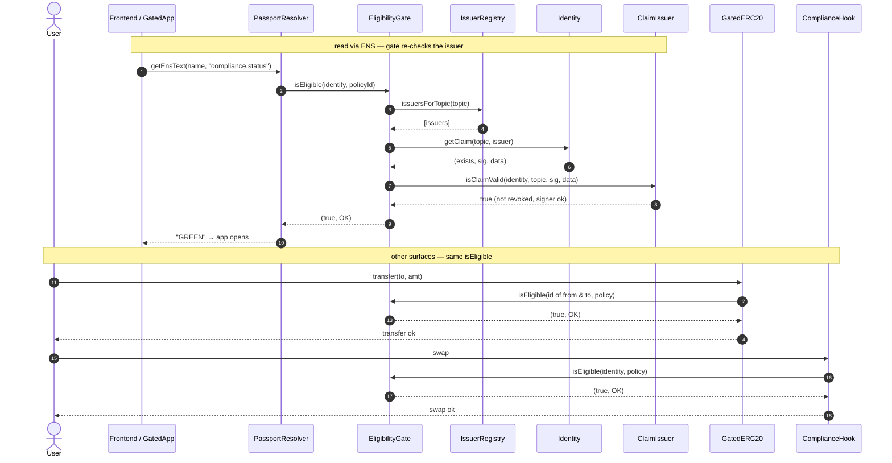
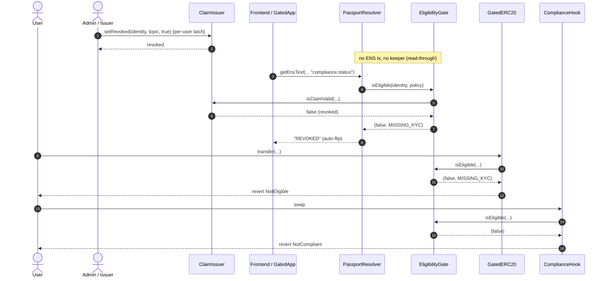

# Flow — sequence diagrams, one per phase

> Paste into HackMD. Each phase is its own small diagram (easier to read). Solid = call, dashed = return.
> The whole system in one line: **every surface reads the same `EligibilityGate.isEligible`** → one `revokeClaim` flips all of them.

## Phase 1 — Onboarding

## Phase 2 — Verify + claim (World + Model B)

## Phase 3 — ENS subname (by code)

## Phase 4 — Access reads (GREEN) — all call the same isEligible

## Phase 5 — Money moment (revoke flips everything)

