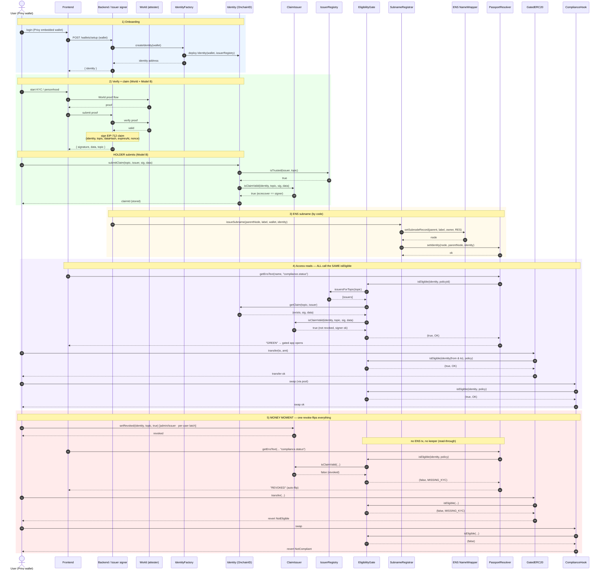

# Flow — sequence diagram (every call, round-trips)

> Paste into HackMD. Solid arrow = call, dashed = return. 5 phases. The point: **all surfaces read the same `isEligible`**, so one `revokeClaim` flips everything.

## Relationships (who calls whom)
- **Identity** = source of truth (claims). Written only by the holder (Model B); read by the gate.
- **ClaimIssuer** = signs claims; verified at write via `isClaimValid` (trust = signature).
- **IssuerRegistry** = trusted issuers per topic → **bounds the gate's loop** (griefing-proof).
- **EligibilityGate** = the single read. Called by **PassportResolver, GatedERC20, ComplianceHook, and the gated app**. It calls IssuerRegistry, reads the claim off Identity, and **re-verifies with the ClaimIssuer**.
- **PassportResolver** = read-through: `text()` → `isEligible` live → ENS reflects state with **zero writes**.
- **Revocation** lives on the **ClaimIssuer** as a **latch** — per-user (`setRevoked(identity, topic, true)`) or global (de-trust issuer / de-authorize signer), re-verified at read. While latched, no fresh claim for that topic can land; re-verification is issuer-gated (`setRevoked(...,false)`). The holder owns their identity but not claim validity. ENS never holds independent state → no drift.

## The one idea
Every surface points at `EligibilityGate.isEligible`. Change the claim once → every surface changes. **The demo is the refusal.**
