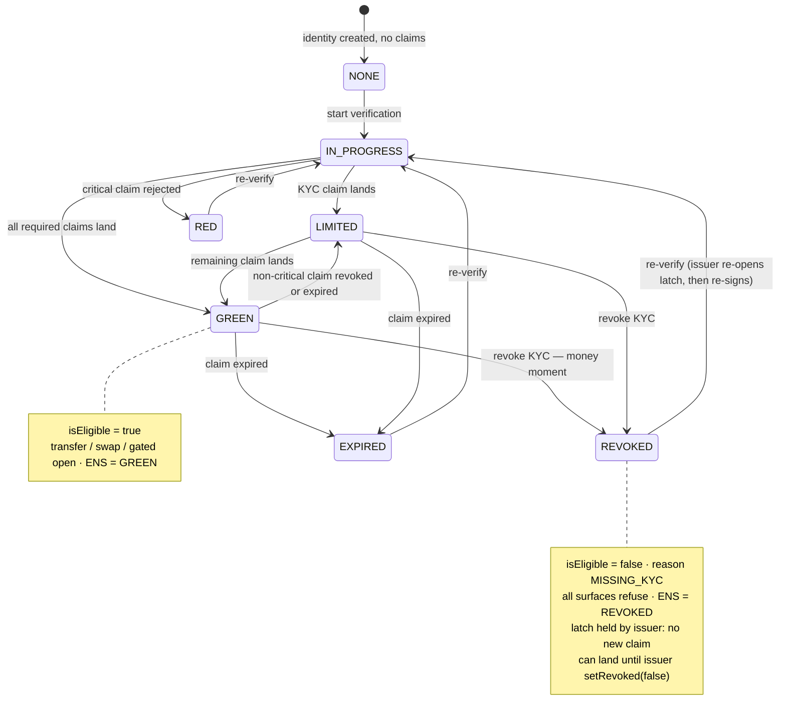

# Passport — state diagram

> Paste into HackMD. The passport status shown on the dashboard. Transitions are labeled by the event.
> Note: "status" is a UI summary; on-chain the truth is `EligibilityGate.isEligible(identity, policyId)` **per policy**.

## What each state means
| State | Meaning | Gate result |
|---|---|---|
| **NONE** | no identity or no valid claims | not eligible (NO_IDENTITY / missing) |
| **IN_PROGRESS** | proof done, claim being submitted (FE/BE state) | not eligible yet |
| **LIMITED** | KYC valid, but not the stricter claims (e.g. no accredited) | ✅ base policy · ❌ investor policy |
| **GREEN** | all required claims valid | ✅ passes the strictest policy |
| **RED** | a critical claim rejected | not eligible |
| **REVOKED** | a required claim revoked | not eligible (MISSING_*) |
| **EXPIRED** | a required claim past `expiresAt` | not eligible |

## Key point (per-policy, not one global status)
- **LIMITED vs GREEN** is just *which policy* you pass: KYC-only opens the Deal Room (policy #1); KYC + accredited opens investor actions.
- The ENS `compliance.status` record simplifies to **GREEN / REVOKED / NONE** for the demo, but the dashboard can show the full set.
- Every transition into a non-eligible state (REVOKED / EXPIRED / RED) is what makes **the four surfaces refuse** — the demo.
